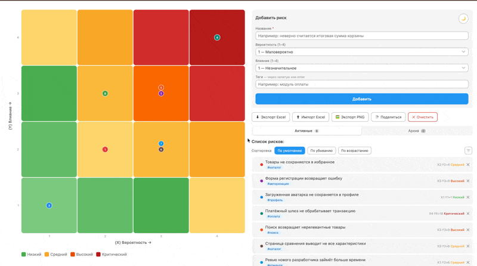

# Risk Matrix Tool 📊

Простой инструмент для приоритизации рисков по вероятности и влиянию.

Помогает быстро понять:
- что критично прямо сейчас
- где команда теряет фокус
- что можно отложить

## 🔗 Live Demo

Попробовать можно по ссылке: [ссылка](https://kinocenitel.github.io/rmt)

## 🖼️ Preview



## 🧩 Features

- Создание, редактирование и удаление рисков
- Сортировка по score (уровень риска)
- Фильтрация по тегам и значению score
- Быстрое выявление «красных» зон
- Архивирование, импорт и экспорт
- Наглядная визуализация

## 🎯 Why

Команды часто тратят время не туда:
- приоритеты размыты
- риски не структурированы
- решения принимаются интуитивно

Матрица помогает навести порядок и сфокусироваться на действительно важном.

## 👥 Use cases

- PM — планирование
- Developer — фокус на критичных зонах
- QA — приоритизация тест-кейсов и багов

## 🛠 How to use

1. Откройте `index.html`
2. Добавьте риски
3. Отсортируйте или отфильтруйте список
4. Сфокусируйтесь на рисках с высоким score
5. При необходимости экспортируйте результат

## 🚀 Installation

```bash
git clone https://github.com/kinocenitel/rmt.git
cd rmt
open index.html
```

## ⚙️ Tech stack

- HTML
- CSS
- JavaScript (single-file, no build tools)
- [xlsx-js-style](https://github.com/gitbrent/xlsx-js-style) — экспорт в Excel с сохранением стилей ячеек.

## 💬 FAQ

Подробный гайд по матрице рисков: [ссылка](https://avbondarenko.yonote.ru/share/risk-matrix)

## ⚖️ License

MIT License © 2026 Aleksey Bondarenko

---

> Хватит спорить о приоритетах. Начните управлять рисками.